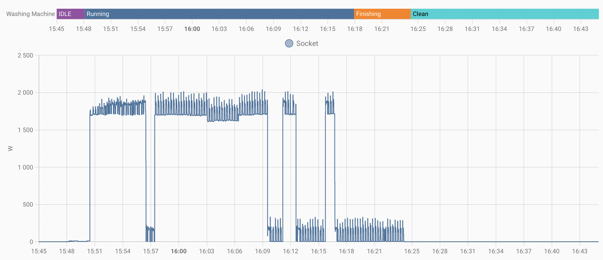
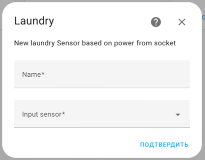

[](https://github.com/hacs/integration)
# Track your Laundry Machine with Home Assistant [Custom Component]



> This component will allow you to track your laundry machine with any smart socket, which provide power state. 
> <br>Additionally it tracks time spend on wash cycle


It will add sensor for each washing machine, which will one of states:
 - Idle
 - Running
 - Finishing
 - Clean (when cycle is finished)

## Use Cases
1. Notify you when cycle is finished
2. Pause your washing machine when state is Finishing, so you spin clothes a bit later (for example right before you wake up)
3. And so on...


## Installation
Install `custom_component` files automatically using [HACS](https://hacs.xyz) (easy way) or install Manually.
## Usage
After installation, you can add sensor via `Devices&Services` -> `Add Integration` -> `Laundry`



Set name for sensor and choose power sensor of socket

## Services

After finishing washing cycle, you need to go from `Clean State` to `IDLE` by using this service

```yaml
service: laundry.reset_machine
data: {}
target:
  entity_id: sensor.test_wash
```


_____
> You can try use it with your dishwasher, but I don't know if it will work. I don't have one, so I can't test it.